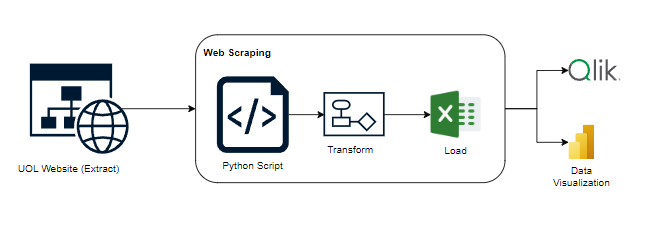

# Web Scraping of UOL Essays (ETL Pipeline)

This project implements an **ETL (Extract, Transform, Load) pipeline** to extract, process, and store essays from **UOL's Essay Bank**, saving the data in **CSV** files for further analysis. It follows the **ETL methodology** to ensure data is collected, cleaned, and structured efficiently.

It uses the following libraries:

- `requests` for HTTP requests  
- `BeautifulSoup` for HTML parsing  
- `csv` for handling extracted data  

---

## 🛠 Features  

### 🔹 **ETL Workflow Overview**  

1. **Extract** → Fetches essays from a predefined list of URLs.  
2. **Transform** → Cleans, structures, and formats the extracted text.  
3. **Load** → Saves the processed data into structured CSV files for analysis.  

### 🔹 Automatic Collection  
Extracts essays automatically from UOL’s platform using web scraping techniques.  

### 🔹 Structured Extraction  
Captures key essay information such as:  
- **Title**  
- **Subtitle**  
- **Essay text**  
- **Evaluated competencies**  
- **Scores and comments**  

### 🔹 Data Transformation  
- **Removes unnecessary spaces** and formats text.  
- **Organizes competencies, scores, and comments** into a structured format.  
- **Ensures consistency in data representation** for further processing.  

### 🔹 Incremental Data Storage  
- Avoids duplicate processing through tracking mechanisms.  
- Maintains an **ID system** to uniquely identify each essay.  

### 🔹 Data Persistence (Load)  
Processed data is stored in the following files:  

- **`dados_redacoes.csv`** → Contains all processed essays with their respective details.  
- **`titulos.csv`** → Lists only essay titles and their identifiers.  
- **`processados.txt`** → Logs already processed links to prevent duplication.  
- **`ultimo_id.txt`** → Keeps track of incrementally generated IDs for each essay.  

---

## 🚀 Technologies Used  

This project is built with Python and uses the following libraries to implement the **ETL process**:

- **Python 3**  
- `requests` → Handles HTTP requests for extracting data.  
- `BeautifulSoup` → Parses and processes HTML content.  
- `csv` → Structures and stores extracted information.  
- `os` and `re` → Manage files and clean text using regular expressions.  

---

### 📌 **Architecture Diagram**  

  

---

## ▶️ How to Run  

1. Clone this repository:  

   ```sh
   git clone https://github.com/your-username/repository-name.git
